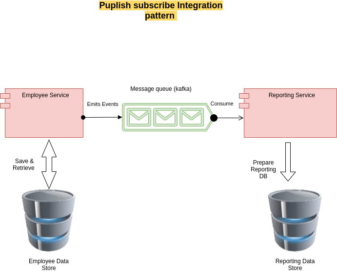

# pplflow Assessment

**First Part:**
frist part is implemented with its considarations
- Being simply executable with the least effort Ideally using Docker.
   * you can run it locally using the following command ``` ./mvnw package && java -jar target/pplflwAssessment-0.0.1-SNAPSHOT.jar ```
 yo can create a docker image using the following command 
 ```
 sudo ./mvnw spring-boot:build-image -Dspring-boot.build-image.imageName=springio/employee-docker
 ```
and then you can run the image in the container using the following command 
```
sudo docker run -p 8080:8080 springio/employee-docker
```
-  For state machine could be as simple as of using ENUM so i'm using ENUM as the states is not so complix 

- Complete test coverage is in the test folder of the app and you can run tests using the following command 
```
./mvnw test
```
- API contract and documentation is Done using OPEN API complient SWAGGER 2 and is available at the following link while the app is running  at the following link
```
http://localhost:8080/swagger-ui/
```
**Second Part**

-  my silver bullet, concerns while I'm reviewing this part is as folllow:
    * Make use of static analysis tool such as SonarQube
    * Check the components in code, their sizes, and their interactions with other components in the code.
    * Identify and look closely at certain types of code hot-spots, such as:
       * Large classes
       * Complex methods
       * Large components
       * Lot of dependencies
       * usee jacoco or similer tool to get the code test  coverage 
       * Uncovered code
    * Review the Junits for complex method and classes, and see how readable the code actually is.
    * Look at the readability of the code, by focusing on the Four Principles Of Simple Design.
- production readiness creteria 
    * Readability
    * Error-handling and logging what happened
    * Maintainability
    * Testability
    * Following the twelve-factor-app methodology 

**Third Part**


